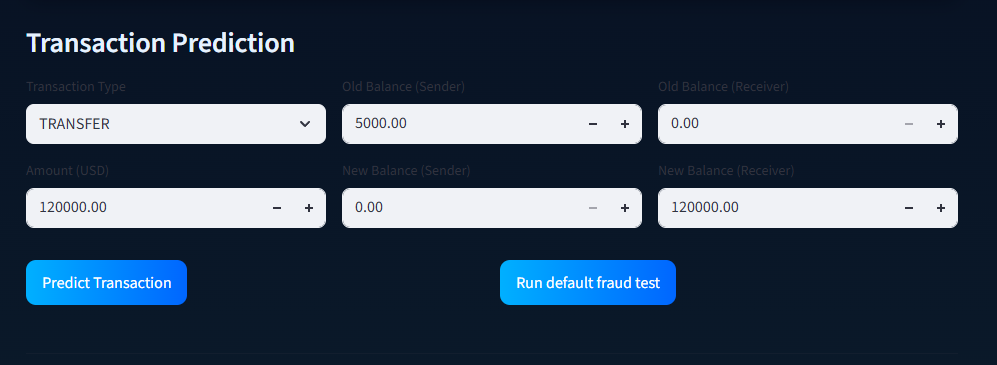
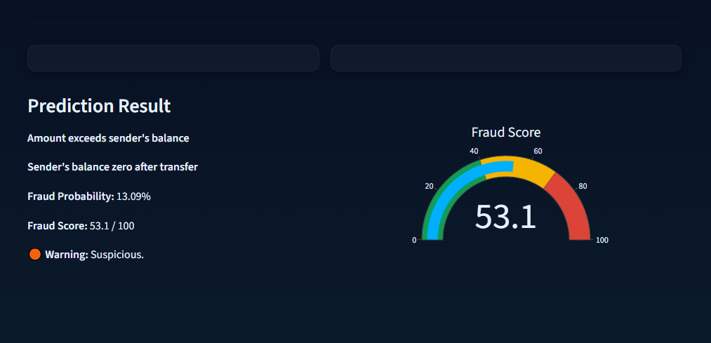
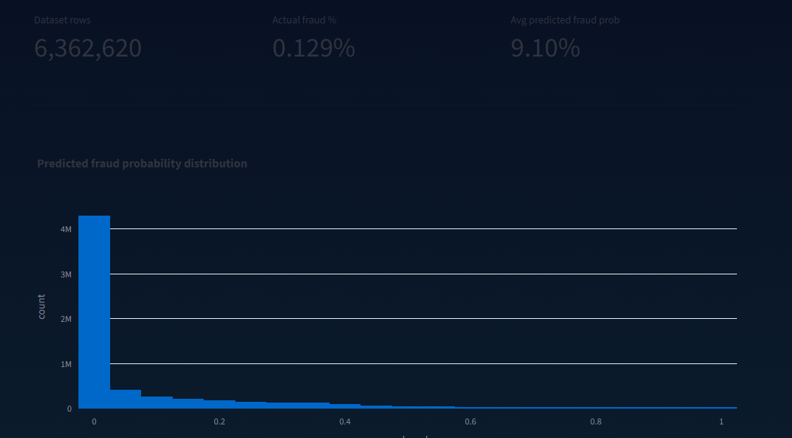
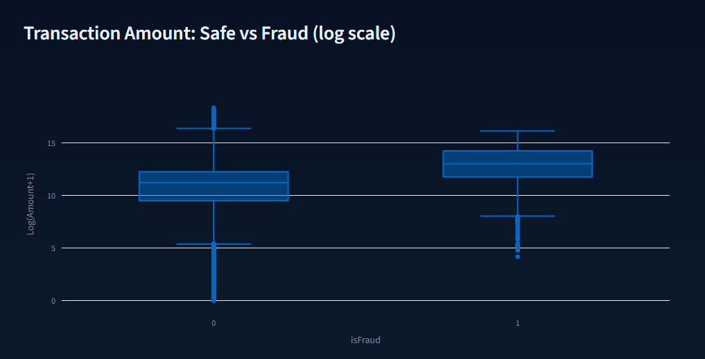
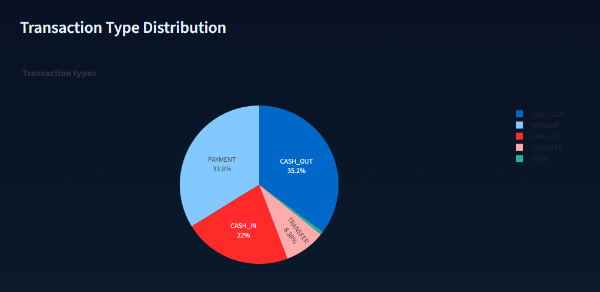
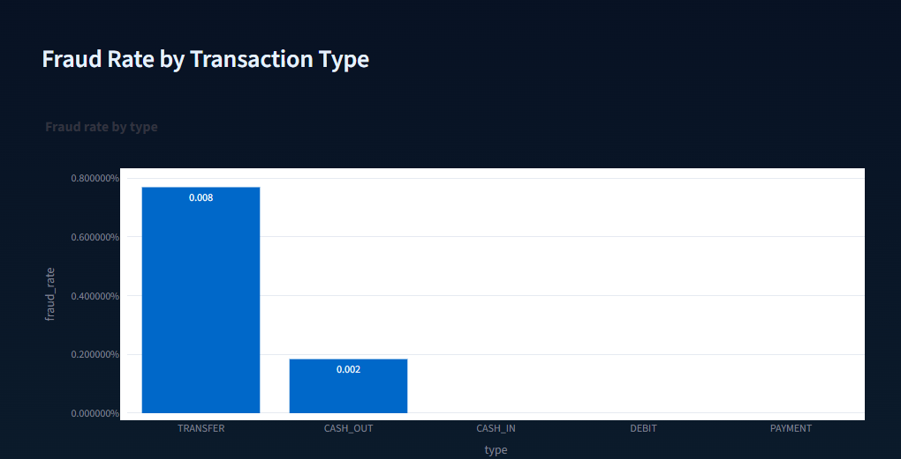
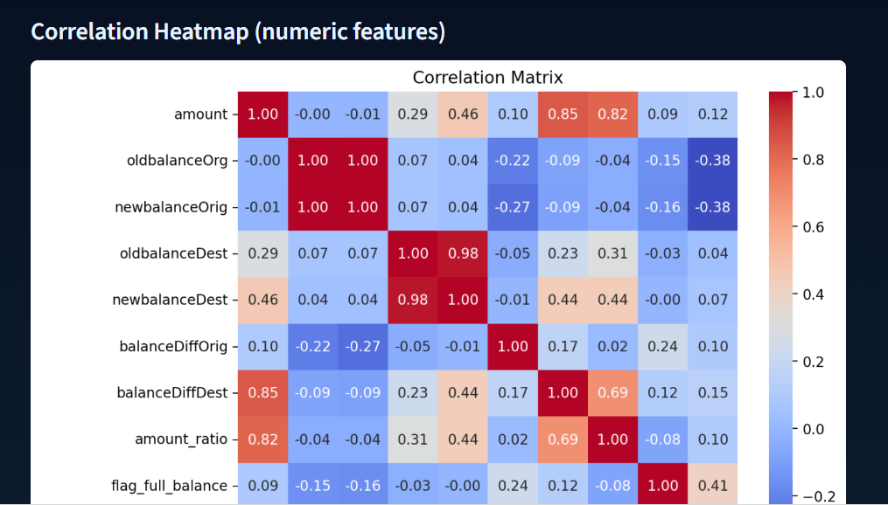
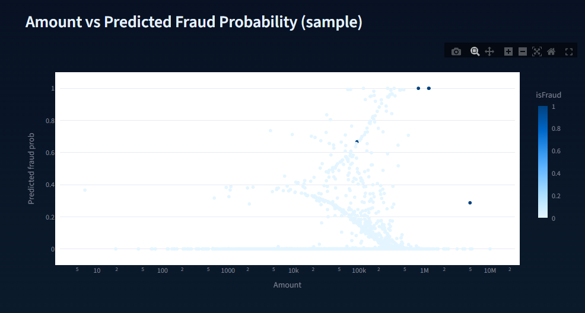
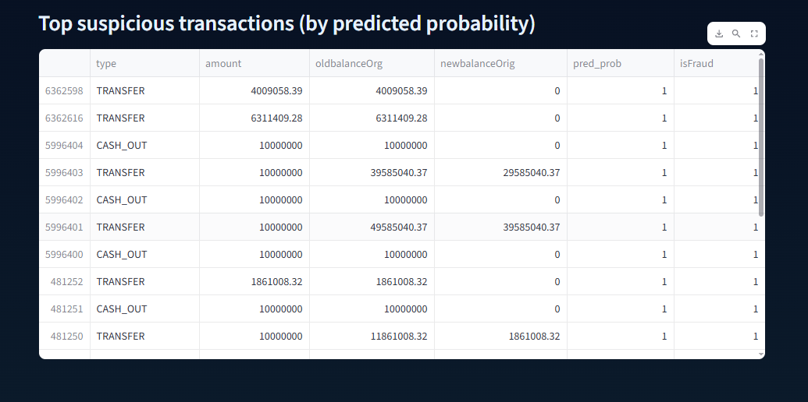

# Fraud Detection in Financial Transactions Using Machine Learning

## Abstract
This project presents a research-oriented machine learning system for detecting fraudulent financial transactions.  

The system emphasizes **behavioral feature engineering**, **probabilistic risk estimation**, and **post-hoc analytical evaluation**, supported by an **interactive experimental dashboard**.  

It is designed as an academic research artifact suitable for MSc applications and further extension into advanced research.

---

## Research Motivation
Fraud detection in financial systems presents several research challenges:

- Extreme class imbalance (fraud cases < 0.2%)
- High cost of false negatives
- Requirement for interpretability in decision-making systems

This project focuses on:

- Modeling **transactional behavior**, not user identity
- Combining **statistical learning** with **domain-driven indicators**
- Providing **transparent and analyzable model outputs**

---

## Dataset Description
- **Dataset:** Financial Transactions Dataset (AIML)  
- **Fraud ratio:** ~0.17%  
- **Transaction types:** TRANSFER, CASH_OUT, PAYMENT, DEBIT, CASH_IN  
- **Features:** Sender and receiver balances before and after the transaction, enabling **balance-based behavioral analysis**  

---

## Interactive Transaction Evaluation

### Transaction Input Interface

The system provides a structured interface for manual transaction testing, allowing controlled experimentation with transaction attributes.

### Prediction Output & Risk Interpretation
  

For each transaction, the model outputs:

- **Fraud probability**
- **Aggregated fraud risk score**
- **Rule-based behavioral alerts**

---

## Fraud Probability Distribution

Distribution of predicted fraud probabilities highlights model behavior under extreme class imbalance.

---

## Transaction Amount vs Fraud Label

Log-scaled comparison between transaction amount and fraud labels shows separation between legitimate and fraudulent transactions.

---

## Transaction Type Analysis

### Transaction Type Distribution

### Fraud Rate by Transaction Type

Fraud incidence varies by transaction type, with **TRANSFER** and **CASH_OUT** showing higher fraud rates.

---

## Feature Correlation Analysis

Correlation heatmap highlights relationships between transaction attributes and engineered balance-based variables.

---

## Model Behavior Analysis

### Amount vs Predicted Fraud Probability

Scatter plot visualizing how predicted fraud probability evolves with transaction amount, revealing risk concentration patterns.

### Top Suspicious Transactions

Table presenting the top suspicious transactions ranked by predicted fraud probability, supporting manual audit and error analysis.

---

## Methodology Summary
- **Model:** Logistic Regression (interpretable baseline)  
- **Preprocessing:**  
  - Standardization of numeric features  
  - One-hot encoding for categorical variables  
- **Feature Engineering:**  
  - Balance differentials  
  - Amount-to-balance ratios  
  - Behavioral risk flags  

This choice prioritizes **interpretability and research clarity** over black-box performance.

---

## Research Value
This project demonstrates:

- Applied machine learning methodology
- Handling of highly imbalanced datasets
- Behavioral feature engineering
- Reproducible experimental evaluation

It is suitable as:

- MSc research portfolio material
- Foundation for academic publication
- Basis for advanced fraud detection research

---

## Author
**Mariam Zakaria**  
MSc Applicant — Machine Learning & Data Science  
**Research Interests:** Fraud Detection, Interpretable ML, Applied AI Systems
